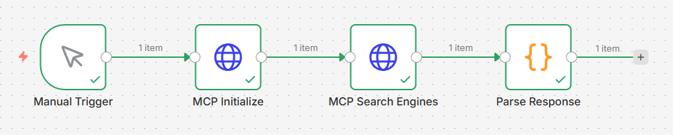

# Delphix DCT MCP Server (Dockerized)

This project provides a Docker container that wraps the Delphix DCT Model Context Protocol (MCP) server, exposing an HTTP interface to facilitate integration with orchestration tools like n8n, which do not natively support `stdio` communication.

## Architecture

The project uses a "Sidecar Wrapper" pattern within the same container:

1.  **HTTP Wrapper (FastAPI)**: Listens for POST requests on port 8000.
2.  **Supervisor**: Manages processes to ensure both (wrapper and MCP server) are always running.
3.  **FIFO Pipes**: Communication between the HTTP wrapper and the MCP server (Python) is handled via named pipes (`mkfifo`) at `/tmp/mcp_in` and `/tmp/mcp_out`.
4.  **Persistence**: The wrapper maintains a persistent connection to the MCP server's `stdin`, allowing for long-lived, authenticated sessions.

## Prerequisites

- Docker or Podman installed on your system.

## Building the Image

To build the image locally, run:

```bash
sudo podman build -t dxi-mcpsrv-docker .
```

(You can replace `podman` with `docker` if that is your preferred runtime).

## Running the Container

The container requires certain environment variables to correctly connect to the Delphix DCT API.

```bash
sudo podman run -d \
  -p 8099:8000 \
  --name dxi-mcpsrv-docker \
  -e DCT_API_KEY="your-api-key-here" \
  -e DCT_BASE_URL="https://your-dct-server.com" \
  -e DCT_VERIFY_SSL="false" \
  -e DCT_LOG_LEVEL="INFO" \
  localhost/dxi-mcpsrv-docker
```

### Environment Variables

| Variable | Description | Default Value |
| :--- | :--- | :--- |
| `DCT_API_KEY` | **Required**. API Key generated in Delphix DCT. | - |
| `DCT_BASE_URL` | **Required**. Base URL of your DCT instance. | - |
| `DCT_VERIFY_SSL` | Validate SSL certificates of the DCT server. | `false` |
| `DCT_LOG_LEVEL` | Log detail level (DEBUG, INFO, ERROR). | `INFO` |

## API Usage

The server exposes a single main endpoint: `POST /mcp`.

### 1. Initialization

**Important:** Before executing any tool, you must send the initialization message to establish the session.

```bash
curl -s -X POST http://localhost:8099/mcp \
  -H "Content-Type: application/json" \
  -d '{
        "jsonrpc":"2.0",
        "id":"init-1",
        "method":"initialize",
        "params":{
          "protocolVersion":"2024-11-05",
          "capabilities":{"tools":{"call":true,"list":true}},
          "clientInfo":{"name":"cli","version":"0.1"}
        }
      }'
```

### 2. Calling Tools

Once initialized, you can invoke the available tools. For example, to use `search_engines`:

```bash
curl -s -X POST http://localhost:8099/mcp \
  -H "Content-Type: application/json" \
  -d '{
        "jsonrpc":"2.0",
        "id":"query-1",
        "method":"tools/call",
        "params":{
          "name":"search_engines",
          "arguments":{"limit":5}
        }
      }'
```

### n8n Integration

We have provided a ready-to-use n8n workflow file in this repository: `Delphix DCT MCP Integration.json`.

#### 1. Importing the Workflow
1.  Open your n8n editor.
2.  Go to **Workflows menu** > **Import from...** > **File**.
3.  Select the `Delphix DCT MCP Integration.json` file from this repository.
4.  The workflow includes nodes for:
    -   **Initialization**: Establishes the session.
    -   **Tool Call**: Example query (Search Engines).
    -   **Parse Response**: Critical step to convert the MCP string output into a usable JSON object.

#### 2. Workflow Logic
Because the MCP protocol returns the result stringified inside a `text` field, we use a Code node to parse it:

```javascript
const mcpResponse = $input.first().json;
const rawText = mcpResponse.result.content[0].text;
return JSON.parse(rawText);
```

#### 3. Result
The final output is a clean JSON object ready for use in subsequent n8n nodes.



## Troubleshooting

### Container Logs

If you encounter issues, check the container logs to see output from both the wrapper and the internal MCP server:

```bash
sudo podman logs -f dxi-mcpsrv-docker
```

### Connection Reset

If the internal MCP server fails or disconnects, the wrapper will return a 500 error indicating "Broken Pipe". In this case, restarting the container will reset it to a clean state.
